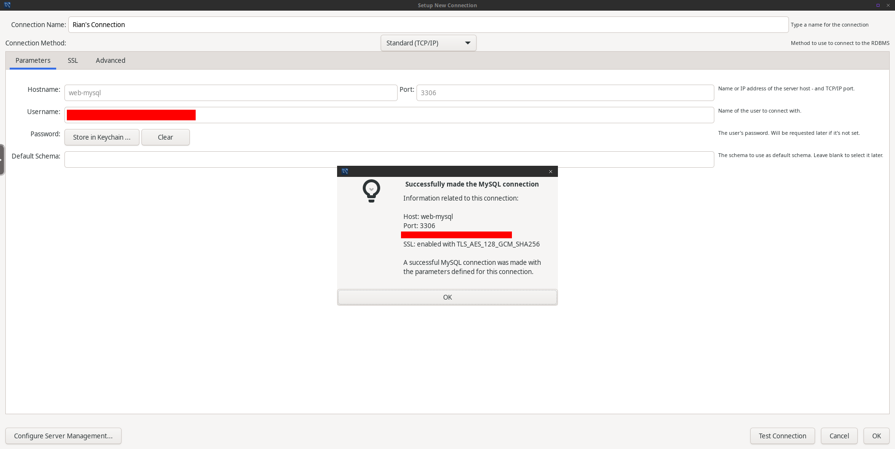

<p align="center">
  
</p>
<p align="center">
    <h1 align="center">ERP Learning</h1>
</p>

## 📍 Visão Geral

ERP Learning (ERPL) é um sistema Web projetado para otimizar os processos organizacionais do negócio em questão. O projeto faz parte dos artefatos de avaliação da disciplina de Programação Web do semestre 2024.1, tendo como objetivo a promoção do desenvolvimento colaborativo apoiado por tecnologias web.

A implementação do sistema segue o padrão Model-View-Controller (MVC), possuindo códigos que interagem tanto do lado do cliente quanto do lado do servidor.


## ⭐ Recursos

|    |   Recurso         | Descrição |
|----|-------------------|---------------------------------------------------------------|
| ⭐  | **Login**  | Autenticação com login e senha. |
| ⭐ | **Logout**    | Desautenticação e saída do sistema. |
| ⭐| **Cadastro de usuário**  | Criação de usuários para funcionários do negócio, permitindo-os acessar o sistema ERP. |
| ⭐| **Error 404 Page**  | Página para a qual o usuário é redirecionado quando faz a requisição de uma rota não cadastrada. |
---

## 🧩 Tecnologias

|    |          | 
|----|-------------------|
| 🧩 | **HTML**  | 
| 🧩 | **CSS**  | 
| 🧩 | **JavaScript**  | 
| 🧩 | **PHP**    |
| 🧩 | **MySQL**  |
| 🧩 | **Docker**  | 
---

## 🚀 Usando o projeto

### ⚙️ Pré-requisitos

```bash
# 1. Ter o docker e o docker compose instalados
# 2. Ter as portas 30000, 30080, 30443, 33000, 33001 e 33306 não ocupadas
```

### ⚙️ Instalação

<h4>1) Clone o repositório do github</h4>

```bash
# Clona apenas a branch necessária
git clone -b 53-cadastrar-novo-usuario --single-branch https://github.com/mobdev-ufopa/erpl
```

<h4>2) Configure o arquivo .env</h4>

```bash
# 1. Crie um arquivo .env na raíz do projeto
touch .env

# 2. Defina as variáveis de ambiente
MYSQL_ROOT_PASSWORD=YOUR_PASSWORD
MYSQL_USER=YOUR_USER
MYSQL_PASSWORD=YOUR_PASSWORD
ADMIN_LOGIN=YOUR_ADMIN_LOGIN
ADMIN_PASSWORD=YOUR_ADMIN_PASSWORD
```

<h4>3) Configure o Docker Compose file (opcional)</h4>

```bash
# Apenas confira se as portas 30000, 30080, 30443, 33000, 33001 e 33306 não estão sendo usadas por algumas aplicação em sua máquina. Se estiverem sendo usadas, mude-as no arquivo compose.yml.
```

<h4>4) Subir os containers</h4>

```bash
# Na raíz do projeto, rode o comando abaixo para subir os containers: web-php, web-mysql, web-workbench.
docker compose up -d

# Para parar os containers após a finalização deste passo a passo, use:
docker compose stop
```

<h4>5) Utilizar o container do PHP para rodar a aplicação</h4>

```bash
# Na raíz do projeto, rode o comando abaixo para entrar no container do PHP
docker exec -it web-php bash

# Para subir o servidor embutido do PHP e rodar a aplicação, execute:
php -S web-php:30000 -t public/
```

### 🖥️ Visualização

<h4>A) Para visualizar a aplicação:</h4>

```bash
# Na barra de pesquisa do navegador, pesquise por:
localhost:30000
```

<h4>B) Para visualizar o MySQL Workbench:</h4>

```bash
# Na barra de pesquisa do navegador, pesquise por:
localhost:33000

# Configure uma nova conexão e preencha conforme a imagem abaixo:
```

<div align="center"> 
	
</div>

```bash
# Após testar a coneção e definir o "Connection Name", clique em "OK" e, na tela HOME, entre na conexão criada. O banco de dados padrão se chama "erpl". A tabela implementada nesta branch se chama "sis_acesso".
```

## 📄 Licença

Este projeto está distribuído sob a **MIT License**. Para mais detalhes, consulte o arquivo [LICENSE](./LICENSE).

---