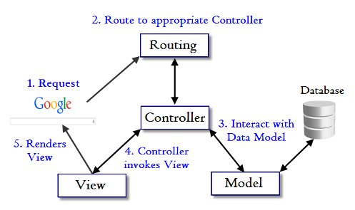
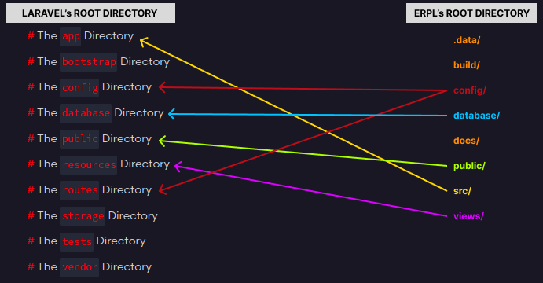

<h1 style="text-align: center;"> Guia do padrão de desenvolvimento do Projeto </h1>

## 📍 Workflow

A implementação do projeto segue o padrão Model-View-Controller (MVC). O _workflow_ do sistema é baseado no que aparece na imagem abaixo.

  
  <label for="workflow">Workflow de execução do sistema. Fonte: <a href="https://backend.turing.edu/module2/lessons/intro_to_mvc#:~:text=Putting%20it%20All%20Together">backend.turing.edu</a>.</label>

<ol class="lista-ordenada">
  <li>O usuário faz a requisição de uma página por meio de uma <code>ROTA</code> (referenciada por algum botão) e um <code>MÉTODO</code> HTTP, capturados pela variável super global <code>$_SERVER</code>.</li>

  <li>Cada tupla <code>ROTA|MÉTODO</code> é mapeada para um controller por meio do arquivo <code>/config/routes.php</code></li>
  <pre>'GET|/login' => \MobdevUfopa\Erpl\Controller\Controller53\LoginFormController::class</pre>

  <li>O controller selecionado pela tupla pode fazer algum CRUD no banco de dados ou não a depender de sua finalidade, mas  sempre devolve um objeto <code>Response</code> ao processasr a requisição.</code></li>
  <pre># Interface que é implementada por cada Controller
interface Controller
{
    public function processRequest(): Response;
}</pre>

  <li>O objeto <code>Response</code> recebe um array de <code>headers</code> e um array <code>body</code>. Neste último, especifica-se a chave <code>pageFile</code> (o caminho sem extensão para o arquivo dentro do diretório <code>/views/</code> cujo conteúdo deverá ser renderizado) e a chave <code>pageData</code> para um array de dados que serão embutidos na página de resposta dinamicamente.</li>
  
  <li>Por fim, no arquivo <code>/public/index.php</code>, o corpo da resposta é carregado na página por meio do método <code>Response()->getBody()</code>. Esse método faz o <code>require</code> da view definida por <code>$body["pageFile"]</code>, exceto se houver um cabeçalho de redirecionamento passado para o objeto <code>Response</code>, como <code>["Location" => "/cadastro-usuario?success=0"]</code>.</li>
  <pre>require_once __DIR__ . '/../../views/' . $this->body['pageFile'] . '.php';</pre>
</ol>

Esse fluxo se repete conforme o usuário interage com o sistema.

## 📂 Estrutura de diretórios

Para organizar os códigos que implementam o fluxo supracitado, a estrutura de diretórios tomou como base a que é usada pelo Laravel na versão 11 (figura a seguir), porém com algumas pastas distintas ou com significados a mais.

  
  <label for="directories">Equivalência de diretórios. Adaptado de: <a href="https://laravel.com/docs/11.x/structure">https://laravel.com/docs/11.x/structure</a>.</label>

